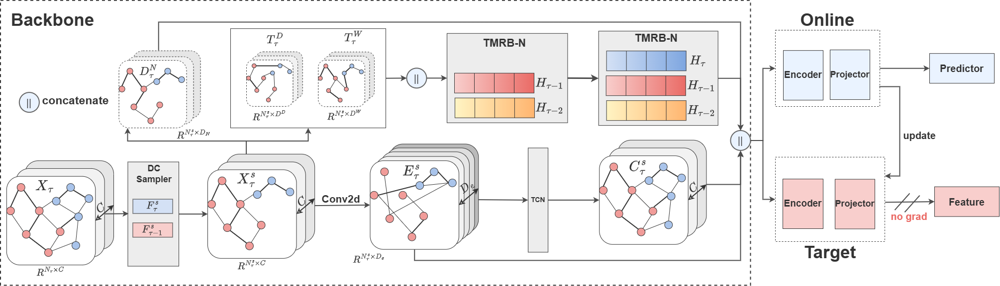
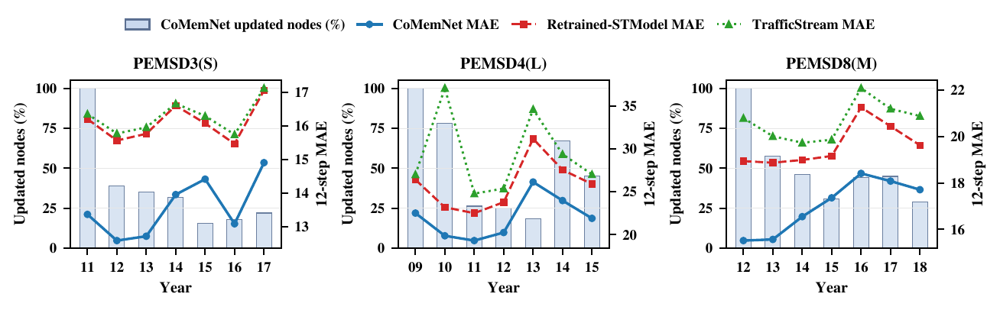

# CoMemNet

CoMemNet is a continual traffic forecasting framework for evolving sensor networks. It combines an adjacency-free prediction backbone, online/EMA-target branches, drift-aware node selection, topology-assisted local updates, and a Node-Adaptive Temporal Memory Replay Buffer (TMRB-N).

This repository also contains the major-revision experiment suite under `config/reviewer/` and `scripts/`. The suite evaluates controlled replay selectors, target-branch and momentum ablations, contrastive-loss variants, graph-dependency variants, continual-learning retention, and computational/storage costs.

<p align="center">
  
</p>

## Overview

Traffic sensor networks do not remain fixed: sensors can be added, removed, or exhibit distribution shifts over time. CoMemNet is designed for this evolving-network setting. Rather than treating every period as an unrelated static forecasting problem, it carries forward learned representations and uses drift-aware selection to focus updates on newly introduced and changed nodes.

The implementation separates the forecasting backbone from the optional topology-assisted update policy. The prediction forward pass is adjacency-free; graph information is used only to expand selected nodes to local neighborhoods in topology-aware update variants.

## Key capabilities

- **Continual updates for evolving sensor sets:** supports annual periods with changing node counts and persistent node identities.
- **Drift-aware selection:** uses the revised Wasserstein selector with shared support and normalization to identify nodes requiring updates.
- **Online/EMA-target branches:** supports stable target representations and explicit target-branch ablations.
- **TMRB-N replay:** maintains temporal memory representations across periods while recording historical-access and memory statistics.
- **Reproducible revision suite:** includes configurations and runners for static retraining, scaling, robustness, retention, and recent static-baseline comparisons.

## Release Resources

- Processed datasets and data-processing documentation: [CoMemNet dataset archive](https://drive.google.com/file/d/1SjsMsZIIWdKxzKxySROnb4Z84t1mZXXU/view?usp=drive_link)
- Major-revision checkpoints, logs, configurations, and result summaries: [CoMemNet revision artifacts](https://drive.google.com/drive/folders/1ABJymMwVhtXJ0mY6m_1dWP1iwjz5X5kb?usp=drive_link)

This Git repository intentionally excludes datasets, generated scale subsets, model weights, logs, and experiment outputs. `PEMSD3-stream` uses the public evolving-network release cited in the manuscript. `PEMSD4(L)` and `PEMSD8(M)` are processed from public CalTrans PeMS records; their processed data and documentation are provided through the dataset link above.

## Main Results

The table below reports final 12-step prediction results against the official STID static-retraining baseline and the official EAC continual baseline. Each entry is `MAE / RMSE`; CoMemNet reports the mean over three random seeds.

| Dataset | CoMemNet | STID | EAC |
|---|---:|---:|---:|
| PEMSD3(S) | **13.70 / 23.21** | 13.79 / **22.65** | 21.37 / 32.22 |
| PEMSD4(L) | **21.95 / 37.33** | 22.81 / 37.84 | 85.97 / 109.72 |
| PEMSD8(M) | **16.89 / 28.18** | 17.65 / 28.51 | 19.55 / 30.91 |

CoMemNet obtains lower 12-step MAE than STID across the three evolving-network datasets while remaining competitive in RMSE. The complete 3-step, 6-step, and 12-step results, together with per-seed summaries, are included in the revision-artifact release.

## Component Ablation

The compact TMRB-N ablation below reports annual-average 12-step MAE for the seed-0 controlled study. `w/o Select` replaces key-node selection with random selection; `w/o Update` removes temporal-state updating.

| Variant | PEMSD3(S) | PEMSD4(L) | PEMSD8(M) |
|---|---:|---:|---:|
| w/o TMRB-N | 14.94 | 23.76 | 18.36 |
| w/o Select | 13.82 | 22.14 | 17.33 |
| w/o Update | 13.63 | 22.15 | 17.10 |
| CoMemNet | **13.57** | **22.00** | **17.03** |

## Update Efficiency

Across evolving periods, CoMemNet updates only a subset of the current node set while retaining competitive 12-step MAE. Bars show the fraction of nodes updated by CoMemNet; lines compare the prediction error of CoMemNet with representative retrained and continual baselines.

<p align="center">
  
</p>

## Repository layout

```text
CoMemNet/
├── main.py                         # training and continual evaluation entry point
├── src/model/                      # backbone, TMRB, and replay selection
├── utils/                          # data loading, preprocessing, and metrics
├── config/                         # main, ablation, parameter, and reviewer configs
├── data/read_data.py               # data-download helper; datasets are external
├── assets/                         # architecture and revision-result figures
├── scripts/
│   ├── generate_reviewer_configs.py
│   ├── run_reviewer_experiments.sh
│   ├── run_round2_revision.sh
│   └── setup_external_baselines.sh
└── paper/reviewer/                 # reviewer-facing Markdown and plotting scripts
```

## Requirements

Python 3.10 or newer is recommended. Install the pinned dependencies with:

```bash
pip install -r requirements.txt
```

An equivalent Conda definition is provided in `environment.yml`:

```bash
conda env create -f environment.yml
conda activate comemnet
```

The main dependencies are PyTorch 2.7.1 or newer, PyTorch Geometric 2.6.1, NumPy, SciPy, pandas, NetworkX, and scikit-learn. Install a PyTorch build compatible with the local CUDA driver when using a GPU.

For an RTX 5090 or another Blackwell GPU with compute capability `sm_120`, install a CUDA 12.8+ wheel explicitly before installing the remaining dependencies:

```bash
pip install --upgrade torch==2.7.1 torchvision==0.22.1 torchaudio==2.7.1 --index-url https://download.pytorch.org/whl/cu128
pip install -r requirements.txt
```

PyTorch 2.5.x CUDA 12.4 wheels do not contain `sm_120` kernels and will fail with `no kernel image is available for execution on the device`.

Verify the environment before training:

```bash
python -c "import torch, scipy, pandas; print(torch.__version__, torch.cuda.is_available())"
```

On Blackwell, verify that `sm_120` is present:

```bash
python -c "import torch; print(torch.__version__, torch.version.cuda, torch.cuda.get_arch_list())"
```

## Data layout

The code expects seven yearly periods for each dataset:

| Dataset | Periods | Nodes in first/last period |
|---|---:|---:|
| PEMSD3-stream | 2011–2017 | 655 / 871 |
| PEMSD4-large | 2009–2015 | 1118 / 2406 |
| PEMSD8-mini | 2012–2018 | 216 / 320 |

Expected files:

```text
data/<dataset>/
├── finaldata/<year>.npz       # raw yearly tensor, key: x
├── graph/<year>_adj.npz       # yearly adjacency matrix, key: x
└── FastData/<year>_30day.npz  # chronological train/val/test cache
```

The current experiment configs use existing `FastData` artifacts (`data_process: 0`). Set `data_process` to `1` only when the cache must be regenerated; these files can require several GB per period.

The D4 scale subsets used in the major revision are generated locally rather than downloaded separately:

```bash
python scripts/prepare_scaling_datasets.py \
  --source PEMSD4-large \
  --ratios 0.25 0.50 0.75
```

## External baseline setup

Third-party baseline repositories and their datasets are not vendored. To install the pinned source revisions needed by the corresponding experiment scripts, run:

```bash
bash scripts/setup_external_baselines.sh
```

This installs STID, STAEformer, EAC, and PDFormer under `baseline/` at the revisions used for this release.

## Basic training

Run CoMemNet on one dataset:

```bash
python main.py \
  --conf config/PEMSD3-stream/model.json \
  --dataset PEMSD3-stream \
  --gpuid 0 \
  --seed 0
```

Other datasets:

```bash
python main.py --conf config/PEMSD4-large/model.json --dataset PEMSD4-large --gpuid 0 --seed 0
python main.py --conf config/PEMSD8-mini/model.json --dataset PEMSD8-mini --gpuid 0 --seed 0
```

Use `--gpuid -1` for CPU execution, although full experiments are intended for a CUDA GPU.

The standard configs include `static.json`, `retrained.json`, `no_TMRB.json`, `no_update.json`, `no_select.json`, `no_replay.json`, and `no_increase.json` for each dataset.

## Major-revision experiments

Regenerate the reviewer-facing configurations after changing their template:

```bash
python scripts/generate_reviewer_configs.py
```

Run a quick one-seed pass:

```bash
GPU_ID=0 SEEDS="0" bash scripts/run_reviewer_experiments.sh
```

Run the full three-seed suite:

```bash
GPU_ID=0 SEEDS="0 1 2" bash scripts/run_reviewer_experiments.sh
```

Resume mode is enabled by default. Re-running the command scans structured summaries and skips every completed dataset/variant/seed combination. An interrupted variant restarts from its first period because checkpoint-level resume within a run is not implemented. Use `RESUME=0` to intentionally repeat all experiments:

```bash
GPU_ID=0 SEEDS="0" RESUME=0 bash scripts/run_reviewer_experiments.sh
```

A single variant can be run independently. For example:

```bash
python main.py \
  --conf config/reviewer/PEMSD3-stream/sampler_feature.json \
  --dataset PEMSD3-stream \
  --gpuid 0 \
  --seed 0
```

Important experiment groups include:

- sampler controls: `sampler_feature`, `sampler_random`, `sampler_recency`, `sampler_high_error`, `sampler_feature_l2`, `sampler_feature_kl`, `sampler_feature_js`, and `sampler_feature_mmd`;
- target controls: `target_no_target`, `target_online_sampler`, and momentum 0.90/0.95/0.99/0.995;
- objective controls: `loss_mae_only` and contrastive weights 0.01/0.05/0.1/0.2;
- topology controls: selected-nodes-only and 1/2/3-hop topology-assisted updates.

The revised Wasserstein selector uses common support and shared normalization. When enabled, the representation objective uses node-wise InfoNCE in addition to prediction MAE.

## Outputs

Normal runs are stored under:

```text
res/<dataset>/<variant><timestamp>/
```

Reviewer experiments are stored under:

```text
res/reviewer/<dataset>/<variant><timestamp>/
├── <variant>.log
├── <year>/<best-validation-loss>.pkl
└── metrics/summary.json
```

The structured summary contains the task-wise evaluation matrix `R[t,j]`, AIP-MAE, backward transfer based on negative MAE, forgetting, and per-period efficiency/storage statistics.

Find all summaries with:

```bash
find res/reviewer -path '*/metrics/summary.json' -print
```

Aggregate repeated seeds:

```bash
python scripts/aggregate_reviewer_results.py \
  --root res/reviewer \
  --output res/reviewer/aggregate.json
```

The aggregate file reports the mean and sample standard deviation of AIP-MAE, forgetting, and BWT for every dataset/variant.

## Experimental protocol notes

- Each period is split chronologically into train/validation/test partitions.
- Validation and test forward passes do not update TMRB state.
- The EMA target stored in a checkpoint is preserved across periods.
- The prediction backbone does not consume adjacency matrices. Adjacency is used only by topology-assisted update variants to expand selected nodes to local neighborhoods.
- The selected-nodes-only graph ablation disables adjacency-based neighborhood expansion.
- The current replay protocol reads historical traffic data for selection. Its accessed file size and adjacency metadata size are reported separately from compact memory state.

See [the revision plan](paper/reviewer/revision_plan.md) for the reviewer-comment-to-experiment mapping and known protocol limitations.

## Citation

Citation information will be updated after publication. If this repository supports your research before then, please cite the accompanying CoMemNet manuscript and link this repository.

## License

No license file is currently included. Please contact the repository authors before redistributing the code or datasets.

### Final main-result seeds and EAC baseline

Run only the missing final CoMemNet seeds (the default checks seeds 0, 1, and 2 on all three datasets and runs only missing configurations):

```bash
GPU_ID=0 SEEDS="0 1 2" RESUME=1 bash scripts/run_final_main_seeds.sh
```

The dedicated mean/std table is written to `res/reviewer/final_main_multiseed.json`.

Run the official EAC implementation with seed 0 on the same frozen chronological splits:

```bash
GPU_ID=0 SEED=0 RESUME=1 bash scripts/run_eac_baseline.sh
```

EAC summaries are written to `res/baseline/EAC/<dataset>/eac-0/metrics/summary.json`. The adapter reuses the exact CoMemNet split artifacts and exposes only the traffic channel expected by EAC. The official EAC model, MSE objective, optimizer, and hyperparameters remain unchanged.
