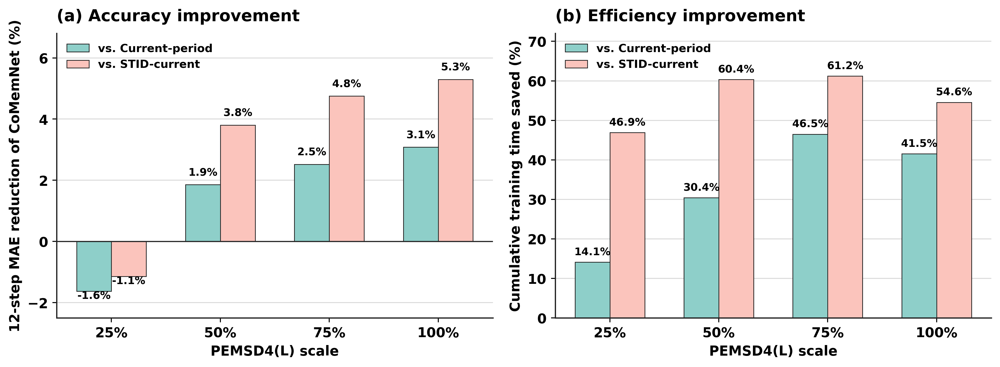

尊敬的审稿人：

感谢审稿人对本文核心必要性提出的严格质疑。该意见促使我们将本轮修订的重点放在轻量静态重训练的直接比较、节点规模扩展和实验可复现性上。

我们选择 STID，正是因为它是轻量、高效且具有竞争力的静态预测模型；如果 CoMemNet 不能在这一基线上体现持续更新的实际价值，其复杂设计就缺乏说服力。

对于审稿人提出的核心问题，即持续学习模型 CoMemNet 相对于轻量静态重训练模型（如 STID）以及近期静态预测模型（如 PatchTST、iTransformer）是否具有性能、训练效率和显存开销上的优势，我们的回答基于直接实验。对于 STID，在演化路网协议下，我们检验 CoMemNet 能否在相近或更好精度下减少累计训练时间和显存占用，以及这种优势是否会随着节点规模扩大而更加清楚。对于 PatchTST、iTransformer 等近期模型，当前实测结果表明，CoMemNet 在保持较好预测性能的同时，具有明显更低的累计训练开销；具体训练配置和 batch size 均在表中列出。

为此，本轮补充了以下材料：1. 公开 PEMSD3-stream 上与近期静态模型的比较；2. 以及更新后的代码仓库、本文构建的 PEMSD4(L)/PEMSD8(M) 全部数据、数据处理说明 3. 本轮返修所用的完整实验结果、运行日志和超参数配置和对应可重复权重。

## 1. 节点规模实验：在中大规模演化网络上的直接证据

我们基于真实 PEMSD4(L)（三个数据集中规模最大的数据集，最终节点数为2406） 构造了 25%、50%、75% 和 100% 的节点规模版本。设最终年度共有 \(N_T=2406\) 个节点，缩放比例为 \(r\in\{0.25,0.50,0.75,1.00\}\)，则最终节点预算定义为

\[
B_r=\operatorname{round}(rN_T).
\]

设第 \(y\) 个年度的原始节点按发布数据中的固定顺序记为 \(V_y=(v_{y,1},\ldots,v_{y,N_y})\)。对应的缩放节点集合为

\[
V_y^{(r)}=\{v_{y,i}\mid 1\le i\le \min(N_y,B_r)\}.
\]

因此，流量张量和邻接矩阵按同一节点索引截取：

\[
X_y^{(r)}=X_y[:,:,1:n_y^{(r)},:],\qquad
A_y^{(r)}=A_y[1:n_y^{(r)},1:n_y^{(r)}],
\]

其中 \(n_y^{(r)}=\min(N_y,B_r)\)。当 \(r=25\%,50\%,75\%,100\%\) 时，\(B_r\) 分别为 602、1203、1804 和 2406。年度顺序、真实流量序列、时间划分、输入特征和邻接格式均保持不变；该构造不复制或合成节点，只控制每个年度参与预测的真实传感器数量。所有 scale 实验均在配备 vGPU-32GB、16 vCPU Intel(R) Xeon(R) 的机器上运行；CoMemNet、Current-only 和 STID 的 batch size 均为 128，且每个年度固定训练 50 个 epoch。表中的时间为 7 个年度的累计训练时间，未包含数据预处理和测试。

| 最终节点规模 | 节点数 | CoMemNet MAE / RMSE | Current-only MAE / RMSE | STID-current MAE / RMSE | 累计训练时间 (s) CoMem / Current / STID | 峰值显存 (MB) CoMem / Current / STID | CoMemNet 相对 STID MAE 差* | CoMemNet 节省时间 相对 Current / STID |
|---|---:|---:|---:|---:|---:|---:|---:|---:|
| 25% | 602 | 25.56 / 41.66 | 25.15 / 41.21 | 25.27 / 40.55 | 218.92 / 254.82 / 412.33 | 496.01 / 501.02 / 507.67 | -0.29 | 14.1% / 46.9% |
| 50% | 1,203 | 23.76 / 40.01 | 24.21 / 40.58 | 24.70 / 40.55 | 272.28 / 391.34 / 686.72 | 891.87 / 955.48 / 1,013.93 | +0.94 | 30.4% / 60.4% |
| 75% | 1,804 | 22.03 / 37.51 | 22.60 / 38.26 | 23.13 / 38.29 | 298.60 / 558.16 / 769.39 | 1,071.11 / 1,424.31 / 1,506.44 | +1.10 | 46.5% / 61.2% |
| 100% | 2,406 | 21.99 / 37.44 | 22.69 / 38.34 | 23.22 / 38.42 | 361.58 / 618.32 / 795.81 | 1,243.61 / 1,894.37 / 2,008.72 | +1.23 | 41.5% / 54.6% |

*MAE 差 = STID-current MAE - CoMemNet MAE；正值表示 CoMemNet 的 MAE 更低。

这组实验严格固定为 50 epoch：每种方法、每个年度均完成 50 个 epoch，不使用由不同收敛速度带来的实际 epoch 差异解释时间优势。CoMemNet 在四个规模下均为累计训练时间最低的方法。相对 Current-only，其时间节省为 14.1%、30.4%、46.5% 和 41.5%；相对 STID-current，其端到端训练时间节省为 46.9%、60.4%、61.2% 和 54.6%。这里的 STID 时间反映官方实现及其数据管线下的实际训练成本，不应被解释为两种网络单步 FLOPs 的比较；同一 CoMemNet 代码路径下的 Current-only 对照才用于隔离持续更新策略本身的资源收益。进一步检查官方 STID 代码后，我们发现其时间嵌入索引使用 `.type(torch.LongTensor)` 构造；当输入和模型均位于 GPU 时，该操作仍会将两个索引张量置于 CPU，再用于 CUDA 嵌入表的索引。因此，STID-current 的端到端时间还包含这一实现级的跨设备索引开销；精度上，602 节点时 STID 的 MAE 略低 0.29；从 1,203 节点开始，CoMemNet 相对 STID 的 MAE 分别低 0.94、1.10 和 1.23。相对同骨干 Current-only，CoMemNet 在 602 节点时 MAE 略高 0.41，而在其余三个规模下分别低 0.45、0.57 和 0.70。

这与上一轮返修信当中 PEMSD3(S) 的结果一致：在 871 节点的公开演化数据集上，CoMemNet 的累计训练时间为 155.37 s，Current-period CoMemNet-backbone 为 190.89 s，即节省 18.6%。该结果不放入本表，因为它来自另一公开数据集；它作为额外证据表明，在 602--2,406 节点范围内，选择性持续更新带来的时间节省并非只出现在单一数据集上。

图由两部分组成：图 (a) 报告 CoMemNet 相对 `Current-period retraining (same backbone)` 和 `STID-current` 的 12-step MAE 改善比例，图 (b) 报告相应的累计训练时间节省比例。正值表示 CoMemNet 的 MAE 或累计训练时间更低。

## 2. 对近期静态预测器的进一步比较

审稿人要求的不只是一个轻量基线，也要求检验近期静态预测器是否会取代 CoMemNet。这里我们将 STID 的两组结果分开报告，避免混淆精度口径和资源口径。上一轮 Table IX 使用 STID 原始实现设置（batch size 64）进行官方静态重训练精度对比；本轮为回应效率质疑，另行补充 batch size 128 下的统一资源测量。我们还按同一冻结年度划分、逐期随机初始化和同周期验证选模协议，加入 DLinear、PatchTST 和 iTransformer。

上一轮精度对比（PEMSD3-stream，STID batch size 64；CoMemNet 为三种子均值，STID 为官方实现 seed 0）如下。该表说明 STID 的确是强轻量静态基线：CoMemNet 的 12-step MAE 略低，但 STID 的 12-step RMSE 更低。

| 方法 | Batch size | Seed | 12-step MAE / RMSE | 说明 |
|---|---:|---:|---:|---|
| CoMemNet | 128 | 0/1/2 | 13.697 / 23.207 | 三种子均值 |
| STID-retrained | 64 | 0 | 13.791 / 22.651 | 官方实现；逐期静态重训练 |

本轮资源测量使用 batch size 128、100 epoch 上限和相同硬件计时口径在PEMSD3(S)。该表用于比较实际训练开销，不替代上一轮 Table IX 的精度表。

| 方法 | Batch size | 训练设置 | 12-step MAE / RMSE | 累计训练时间 (s) | 峰值显存 (MB) | 参数量 |
|---|---:|---|---:|---:|---:|---:|
| CoMemNet | 128 | 100 epoch 上限，patience 50 | 13.42 / 22.72 | 169.25 | 537.60 | 301,912 |
| STID-current | 128 | 100 epoch 上限，patience 20 | 14.20 / 23.32 | 385.21 | 727.99 | 138,348 |
| DLinear-style current | 128 | 100 epoch 上限，patience 20 | 22.85 / 37.44 | 264.90 | 58.14 | 156 |
| PatchTST-Lite current | 32 | 100 epoch 上限，patience 20 | 17.27 / 28.72 | 3,230.44 | 2,481.91 | 70,540 |
| iTransformer-Lite current | 16 | 100 epoch 上限，patience 20 | 15.25 / 25.42 | 2,647.06 | 128.89 | 68,556 |

从架构上看，STID 和 DLinear 分别是 MLP/线性类轻量预测器，不涉及自注意力中的 query-key 两两相关计算。二者的表达能力并不相同：STID 通过 spatial/temporal identity embeddings 显式区分节点和时间位置，而本文的 DLinear-style current 主要保留序列分解和线性预测层，对所有节点共享线性映射，不建模节点身份、路网关系或跨节点交互。因此，DLinear 的参数和显存极小，但在演化交通网络上的 12-step MAE/RMSE 明显偏高；这反映该轻量适配结构在本协议下表达能力不足，而不是本文用它替代原论文完整超参数搜索的结论。PatchTST-Lite 在每个节点内对时间 patch 计算 self-attention；iTransformer-Lite 则将节点作为 token，需要计算节点间的 \(QK^\top\) 和注意力加权，节点数增大时该部分具有 \(O(N^2)\) 的交互规模。典型 STGNN 还需要沿图边进行多层消息传递。因而，这些 Transformer 或重型图模型通常不以持续更新效率为设计目标。

这不是仅由理论复杂度推断：在当前冻结划分和各自可稳定运行的配置下，PatchTST-Lite 和 iTransformer-Lite 的累计训练时间均显著高于 CoMemNet。DLinear 的参数和显存极小，但其七周期累计时间仍高于 CoMemNet；这并不表示 DLinear 的单次前向或反向计算更慢。DLinear 在每个周期均从头训练当前全部节点，而 CoMemNet 在后续周期只更新选中的新增/漂移节点；两者经 early stopping 后的实际训练 epoch 也可能不同。该结果说明，较少参数并不自动转化为演化网络上的更低累计更新成本。由于 PatchTST-Lite 与 iTransformer-Lite 分别使用 batch size 32 和 16，和 batch size 128 的 CoMemNet/STID/DLinear 不构成严格的同 batch 吞吐量排名；表中完整列出配置，时间结果用于呈现实际可运行开销，而非将不同 batch 的模型强行作微小速度差的结论。

PatchTST-Lite、iTransformer-Lite 和 DLinear-style 已在同一数据切分上完成可复现适配，但不被表述为对原论文全部超参数搜索空间的替代。修订稿将公开其结构、训练配置和代码，并将官方实现与协议兼容实现分开列示。

## 3. All-history retrained 的架构澄清

审稿人认为原表 VIII 的 3,256.83 s 可能来自“某个重型 STGNN backbone”。这一点与实际实验设置不符。原表中的 All-history retrained 使用的是 CoMemNet 的同一 Basic_Model 主干，而非重型 STGNN：其由时间/节点嵌入、历史嵌入层、TCN、两层 MLP encoder、prediction head、EMA Target 分支和 TMRB-N 组成；预测主干不包含图卷积，也不把邻接矩阵输入前向预测；总参数量为 301,912。

| 协议 | 初始化和训练数据 | 更新范围 | 选择/重放设置 |
|---|---|---|---|
| Full CoMemNet | 继承上一周期模型；仅训练当前周期数据 | 新增节点 + 漂移共享节点 + 可选邻域 | 启用 |
| Current-only CoMemNet-backbone | 每周期随机初始化；仅训练当前周期数据 | 当前周期全部节点 | 关闭 |
| All-history CoMemNet-backbone | 每周期随机初始化；读取截至当前周期的全部训练数据 | 当前节点集合 | 关闭 |

因此，3,256.83 s 的含义是：**在相同 CoMemNet backbone 下，从零开始并在每个周期重复训练累计历史样本的成本。** 这一结果不被用作 STID-all-history 的代理，也不被用来推断所有轻量模型的全历史重训练成本。为避免歧义，我们会将旧表中的 `All-history retrained`、`Current-period retrained` 分别重命名为 `All-history CoMemNet-backbone` 和 `Current-only CoMemNet-backbone`，并在表注中给出上述架构与数据访问边界。

我们也将加入经过独立核验的 STID-all-history 对照；在其跨年度归一化、节点补齐和模型选择协议完全确认前，不会将未经验证的数值写入论文。

## 4. 数据集来源与可复现性

关于数据集，审稿人将 PEMSD3(S)、PEMSD4(L) 和 PEMSD8(M) 一概视为“作者自行构建的数据集”并不完全准确：

- **PEMSD3-stream** 是已有研究公开发布并已被使用的演化交通数据集。本文使用其公开的年度传感器演化设置，不是从原始数据任意划分得到。
- **PEMSD4(L) 与 PEMSD8(M)** 的原始交通记录均来自 CalTrans PeMS 公开数据。参考公开的 PEMSD3-stream 演化路网设置，本文构建这两个数据集的目的在于扩展持续学习交通预测的验证场景，并覆盖不同节点规模和网络演化梯度。具体而言，我们进行了可复现的数据处理，包括年度范围确定、传感器质量筛选、跨年度节点映射、基于元数据的邻接构建，以及按时间顺序划分训练、验证和测试集。两个数据集均基于真实传感器观测构建，不包含合成节点或合成流量数据。

为方便社区独立复核，我们将完整公开数据处理链。对于 PEMSD4(L) 和 PEMSD8(M)，处理从 CalTrans PeMS 的 5 分钟检测器记录开始：按年度整理记录，以传感器 ID 对齐跨年度节点；剔除缺失率不低于 10% 或 State Post-Mile 不小于 100 的检测器；为构造离线演化基准，仅保留在下一年度仍出现的传感器。图仅在相同道路/行驶方向的传感器间建立，并依据 State Post-Mile 的绝对差构造邻接关系（\(\epsilon=1,\delta=100\)）。随后按时间顺序生成年度流量张量 `finaldata/<year>.npz`、年度邻接矩阵 `graph/<year>_adj.npz` 和训练/验证/测试缓存 `FastData/<year>_30day.npz`；scale 子集由公开脚本按固定节点顺序同步截取三类文件，并写出逐年度节点数和张量形状的 manifest。我们将同时提供原始数据来源与校验值、年度传感器 ID/节点映射、时间范围、筛选规则、边列表、处理后 split、配置、日志和结构化结果。

本轮材料的访问入口先在修订稿和补充材料中预留如下位置：

- 原始数据、处理后数据及数据处理说明（Google Drive）：`[待填：Google Drive URL]`。
- 本轮新增实验的完整结果、运行日志和汇总表：`[待填：experiment-results URL]`。
- 更新后的代码仓库、配置文件和数据处理脚本：`[待填：repository URL]`。

对于因原始数据许可而不能镜像的文件，我们将同时给出官方下载入口、下载版本和校验流程，并提供可再分发的样例原始数据和处理后元数据。

## 5. 对论文表述和结构的修改

本轮修订将进行以下具体修改：

1. 将 STID 的精度和资源结果合并到同一协议表，删除由不同表格相邻放置造成的成本歧义。
2. 在所有资源表中显式写出 backbone、初始化方式、历史数据访问范围、节点更新范围和 replay/sampling 开关。
3. 增加 PEMSD4(L) 的四档真实节点规模实验，报告 MAE、RMSE、训练时间、显存、更新节点比例和历史访问量。
4. 增加近期静态预测器的比较，并明确区分官方复现与协议兼容适配实现。
5. 在数据集部分明确 PEMSD3-stream 的公开来源，完整描述 PEMSD4(L)/PEMSD8(M) 的处理规则，并给出原始/处理后数据、本轮实验结果和更新代码仓库的访问链接。

综上，STID 的强性能并不否定 CoMemNet 的研究问题；它要求我们以直接、统一的实验口径证明持续更新的实际价值。新增直接资源比较和规模实验表明，在本文研究的演化节点协议中，CoMemNet 并非依赖于重型模型或模糊的 all-history 对照来获得效率优势，而是在中大规模真实传感器网络上以更低的累计更新成本维持竞争性乃至更优的预测精度。我们感谢审稿人促使我们将这一点以更清晰、可复核的方式呈现。
